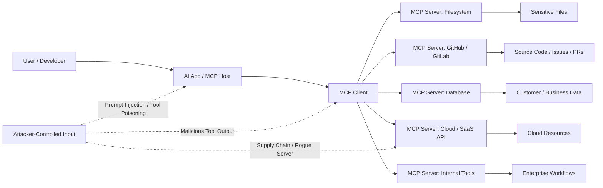

# Project Overview

**Awesome MCP Security** is a curated knowledge base for everything related to **Model Context Protocol security**.

The Model Context Protocol, or MCP, is an open protocol that allows LLM applications to connect with external data sources, tools, prompts, workflows, and services in a standardized way. MCP servers can expose **resources**, **prompts**, and **tools**, while MCP clients and hosts may interact with filesystem boundaries, user approvals, model sampling, and external execution flows. ([Model Context Protocol][1])

This repository treats MCP as a **new security boundary**.

MCP is where AI systems stop being “chat interfaces” and start becoming systems that can read files, call APIs, query databases, execute functions, trigger workflows, interact with enterprise tools, and make decisions that affect real environments. That means MCP security is not only about protecting prompts. It is about protecting the entire chain between the user, the model, the MCP client, the MCP server, the connected tool, and the target system.

The official MCP specification explicitly warns that MCP enables powerful capabilities through arbitrary data access and code execution paths, and that implementers must carefully address security and trust considerations. ([Model Context Protocol][1])

## Contents

- [1. Why MCP Security Matters](#1-why-mcp-security-matters)
  - [1.1 Key Risk Areas](#11-key-risk-areas)
    - [Data Leakage](#data-leakage)
    - [Unauthorized Actions](#unauthorized-actions)
    - [Prompt Injection Chains](#prompt-injection-chains)
    - [Tool Poisoning](#tool-poisoning)
    - [Supply Chain Compromise](#supply-chain-compromise)
    - [Shadow MCP Servers](#shadow-mcp-servers)
    - [Weak Monitoring and Auditability](#weak-monitoring-and-auditability)
- [2. Security Principle for This Project](#2-security-principle-for-this-project)


```mermaid
flowchart LR
    U[User / Developer] --> H[AI App / MCP Host]
    H --> C[MCP Client]
    C --> S1[MCP Server: Filesystem]
    C --> S2[MCP Server: GitHub / GitLab]
    C --> S3[MCP Server: Database]
    C --> S4[MCP Server: Cloud / SaaS API]
    C --> S5[MCP Server: Internal Tools]

    S1 --> D1[Sensitive Files]
    S2 --> D2[Source Code / Issues / PRs]
    S3 --> D3[Customer / Business Data]
    S4 --> D4[Cloud Resources]
    S5 --> D5[Enterprise Workflows]

    A[Attacker-Controlled Input] -. Prompt Injection / Tool Poisoning .-> H
    A -. Malicious Tool Output .-> C
    A -. Supply Chain / Rogue Server .-> S4
```

At a simple level:

```text
User
  |
  v
AI Application / MCP Host
  |
  v
MCP Client  <---- trust boundary ---->  MCP Server
                                      |
                                      v
                         Files / APIs / DBs / SaaS / Code / Cloud
```

The purpose of this project is to help the community understand, test, monitor, and secure this new layer before MCP becomes another invisible piece of enterprise infrastructure.

---

## 1. Why MCP Security Matters

MCP security matters because MCP gives AI applications access to things that matter.

A traditional chatbot might generate text. An MCP-enabled AI application can read files, call APIs, query databases, interact with code repositories, trigger workflows, and execute tools. That changes the risk model completely.

The official MCP security guidance discusses attack categories such as confused deputy risks, token passthrough, SSRF, session hijacking, local MCP server compromise, and scope minimization. ([Model Context Protocol][4])

In simple terms:

```text
Without MCP:
Prompt goes in -> Text comes out

With MCP:
Prompt goes in -> Model reasons -> Tool is selected -> Action is executed -> Data moves
```

That means an MCP security failure can become a real-world security incident.

### 1.1 Key Risk Areas

#### Data Leakage

MCP servers may expose files, documents, repositories, databases, tickets, logs, cloud assets, or internal APIs. If permissions are too broad, if context is over-shared, or if tool outputs are not handled safely, sensitive data may leak into prompts, logs, model context, or unauthorized destinations.

#### Unauthorized Actions

If an MCP tool can send emails, modify tickets, create cloud resources, update code, run commands, or access business systems, then weak authorization can lead to unauthorized actions. The risk is not only “what the model says,” but “what the connected tool does.”

#### Prompt Injection Chains

Prompt injection becomes more dangerous when the model has access to tools. A malicious webpage, document, issue comment, email, log entry, or tool response may contain instructions that influence the model to call tools incorrectly, leak data, or bypass intended workflows. OWASP guidance recommends treating tool responses as untrusted input and explicitly instructing models that tool return values are data, not instructions. ([OWASP Cheat Sheet Series][3])

#### Tool Poisoning

MCP tools are often described to the model using natural language metadata. If a tool description is malicious, misleading, or modified after approval, the model may be tricked into using the tool in unsafe ways. The MCP specification itself notes that tool behavior descriptions should be treated as untrusted unless obtained from a trusted server. ([Model Context Protocol][1])

#### Supply Chain Compromise

MCP servers may be installed from public repositories, package managers, internal registries, or community examples. A malicious or compromised MCP server can become a bridge into developer machines, source code, credentials, internal APIs, or enterprise workflows. OWASP recommends installing MCP servers only from trusted sources, reviewing source code and tool definitions, verifying package integrity, scanning dependencies, and monitoring for tool definition changes. ([OWASP Cheat Sheet Series][3])

#### Shadow MCP Servers

As developers adopt AI IDEs and agentic tools, organizations may discover MCP servers running locally or inside workflows without central review. These shadow servers can create blind spots around data access, logging, approval flows, and third-party risk.

#### Weak Monitoring and Auditability

If MCP tool calls are not logged, security teams may not know which model called which tool, with what parameters, under which user identity, and what data was returned. This makes incident response, compliance, and forensic investigation much harder.

---

## 2. Security Principle for This Project

The core security idea behind this repository is simple:

> **Treat every MCP server as a security boundary, every tool as a privileged action, every tool description as untrusted input, and every model-mediated action as something that must be logged, authorized, and reviewable.**

A secure MCP ecosystem should include:

* Least privilege for every MCP server and tool
* Clear user consent before sensitive tool calls
* Strong authentication and authorization
* Sandboxed local execution
* Secrets protection
* Tool input and output validation
* Trusted server installation and package verification
* Monitoring for tool changes and suspicious usage
* Centralized logging and audit trails
* Human approval for destructive or sensitive actions
* Incident response playbooks for MCP abuse


```text
MCP turns AI from "assistant" into "operator."

That is powerful.
That is useful.
That is risky.

And that is why MCP security matters.
```

[1]: https://modelcontextprotocol.io/specification/2025-11-25 "Specification - Model Context Protocol"
[2]: https://owasp.org/www-project-mcp-top-10/ "OWASP MCP Top 10 | OWASP Foundation"
[3]: https://cheatsheetseries.owasp.org/cheatsheets/MCP_Security_Cheat_Sheet.html "MCP Security Cheat Sheet - OWASP Cheat Sheet Series"
[4]: https://modelcontextprotocol.io/docs/tutorials/security/security_best_practices "Security Best Practices - Model Context Protocol"

---

## Review Update: Practical Security Lens

This overview is strongest when it treats MCP as an operational security boundary, not just a protocol feature. The sections above explain why MCP matters; the additions below translate that framing into practical questions teams can use when evaluating MCP clients, servers, tools, and deployments.

### Threat Modeling Questions

Before adopting or publishing an MCP server, ask:

* What data can this server read, and under whose identity?
* What actions can its tools perform?
* Which actions are read-only, write-capable, destructive, privileged, or externally visible?
* Can tool outputs influence later tool calls?
* Can untrusted content enter the model context through documents, webpages, tickets, logs, emails, repository issues, or database rows?
* Are tool descriptions, schemas, and server manifests pinned, reviewed, and monitored for changes?
* Are secrets ever exposed through prompts, logs, traces, tool outputs, environment variables, or error messages?
* Can one MCP server indirectly influence another MCP server through shared context?
* Is there a reliable audit trail showing user intent, model-selected tools, arguments, approvals, returned data, and resulting actions?

### Deployment Checklist

A secure MCP deployment should include:

* Server allowlisting and inventory management
* Per-server and per-tool permission scoping
* Separate identities for users, clients, servers, and downstream services
* Short-lived, audience-bound credentials for remote services
* No token passthrough from MCP clients to unrelated downstream APIs
* Sandboxing for local servers and command execution
* Explicit approval flows for sensitive, destructive, financial, production, or externally visible actions
* Input validation for tool arguments
* Output handling rules that treat tool responses as data, not instructions
* Logging that captures tool name, arguments, caller identity, approval state, timestamp, and result status
* Alerting for new servers, changed tool descriptions, privilege expansion, unusual call volume, and failed authorization attempts
* A process for revoking server access, rotating credentials, and disabling compromised tools

### Common Failure Modes

MCP risk often appears through small configuration decisions that compound over time:

* A local filesystem server is granted access to an entire home directory instead of a project folder.
* A development MCP server is reused in production without review.
* A tool description is trusted as if it were code, even though the model relies on it for tool-selection behavior.
* A server uses broad OAuth scopes because narrow scopes are inconvenient during development.
* Tool results from untrusted sources are placed directly into model context without labeling or filtering.
* Logs capture prompts, tool arguments, or returned data that contain credentials or sensitive business records.
* Multiple MCP servers share the same model context, allowing one untrusted data source to influence actions in another system.

### Recommended Assurance Activities

Security teams can evaluate MCP systems through a combination of design review, testing, and runtime monitoring:

* Review server source code, package provenance, tool schemas, and permissions before installation.
* Run prompt-injection tests using malicious documents, webpages, ticket comments, repository issues, and tool responses.
* Test authorization boundaries with users who should have different access levels.
* Verify that sensitive tools require user approval and that approvals are specific to the action being performed.
* Confirm that credentials are scoped, rotated, and never written to prompts, traces, or general application logs.
* Compare tool definitions over time to detect renamed tools, changed descriptions, new parameters, or expanded behavior.
* Exercise incident response by disabling an MCP server, revoking credentials, and reviewing historical tool-call logs.

### Maturity Model

MCP security maturity can be viewed in four stages:

| Stage | Description |
| --- | --- |
| Ad hoc | Developers install MCP servers manually with little inventory, review, or logging. |
| Managed | Approved servers are documented, permissions are scoped, and sensitive actions require user consent. |
| Monitored | Tool calls, schema changes, failed authorization attempts, and unusual usage patterns are logged and alerted. |
| Governed | MCP servers are managed through central policy, supply chain review, continuous testing, and incident response workflows. |

The goal is not to block MCP adoption. The goal is to make MCP adoption observable, governable, and resilient enough for real environments.
